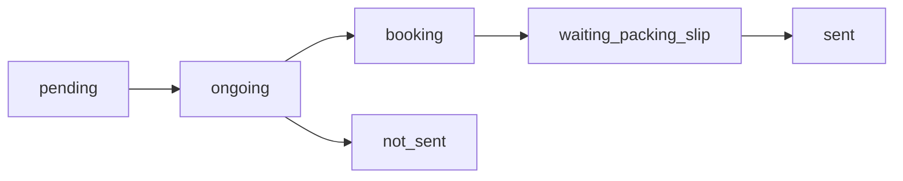

# KISS-Web User Manual, Operations Manual, and Troubleshooting Guide

System: KISS-Web Warehouse Management System  
Version: Not specified in the source code  
Date generated: 2026-06-16  
Prepared by: Codex, from review of the KISS-Web source code

## Table of Contents

1. [Introduction](#introduction)
2. [System Overview](#system-overview)
3. [System Requirements](#system-requirements)
4. [Login and Account Guide](#login-and-account-guide)
5. [Roles and Access](#roles-and-access)
6. [Module Guide](#module-guide)
7. [Inventory Tables and Important Fields](#inventory-tables-and-important-fields)
8. [Daily Operations](#daily-operations)
9. [Order Workflow](#order-workflow)
10. [Import, Export, and Printing](#import-export-and-printing)
11. [Notifications](#notifications)
12. [Best Practices](#best-practices)
13. [Troubleshooting and Recovery](#troubleshooting-and-recovery)
14. [Backup and Restore](#backup-and-restore)
15. [Emergency Recovery Checklist](#emergency-recovery-checklist)
16. [Glossary](#glossary)
17. [Developer and Support Notes](#developer-and-support-notes)

## Introduction

KISS-Web is a local warehouse inventory management system used to record stock locations, pallet quantities, product/component/raw material stock, outbound orders, picking, dispatch, and transaction history.

The system is intended for:

- Warehouse staff
- Inwards staff
- Outwards staff
- Raw Materials staff
- Administrators
- Supervisors
- Future developers and support staff

This manual is based on the current PHP, JavaScript, and SQL implementation in the repository. It does not describe features that were not found in the source code.

## System Overview

KISS-Web is built with:

- PHP
- MySQL or MariaDB
- PDO database access
- JavaScript
- HTML and CSS
- Composer packages:
  - `phpoffice/phpspreadsheet`
  - `tecnickcom/tcpdf`

The application is designed for a local XAMPP deployment. The database configuration in `php/conn/config.php` is:

| Setting | Value |
| --- | --- |
| Host | `127.0.0.1` |
| Port | `3306` |
| Database | `kiss-web` |
| User | `root` |
| Password | blank |
| Charset | `utf8mb4` |

## System Requirements

### Server or Laptop

- Windows laptop or PC
- XAMPP installed
- Apache running
- MySQL or MariaDB running
- KISS-Web files copied into the web root, commonly `htdocs/kiss-web`
- Local network access if other devices need to open KISS-Web

### Browser

Use a modern browser with JavaScript enabled. The interface depends on JavaScript for searching, sorting, dialogs, imports, order previews, picking, and printing actions.

Some styling and icons are loaded from external CDNs:

- Bootstrap CDN
- Font Awesome CDN
- Google Fonts

If the site is used without internet access, the main system should still load locally, but icons or fonts may look different unless those files are hosted locally.

### Printer Setup

Product labels and carton labels are generated as PDFs with TCPDF and sent to:

`C:\print\print_pdf.cmd`

Label printing will not work silently unless that script exists and is correctly configured on the Windows machine.

## Login and Account Guide

[Insert Screenshot: Login Page]

### Logging In

1. Open the KISS-Web URL in the browser, for example `http://localhost/kiss-web/`.
2. If not already logged in, the system redirects to `login.php`.
3. Enter the username.
4. Enter the password.
5. Click **Log In**.

The system checks the username against the `users` table and verifies the password using PHP password hashing.

### Signing Up

[Insert Screenshot: Signup Page]

The signup page allows a new user to create an account with:

- Name
- Username
- Password
- Role

Allowed roles are:

- `Inwards`
- `Outwards`
- `Rawmat`
- `Admin`

After successful signup, the user is sent back to the login page.

### Logging Out

Click the sign-out icon in the sidebar. This calls `logout.php`, clears the session, destroys it, and redirects to the login page.

### Session Handling

The session behavior is different by device type:

| Device Type | Session Behavior |
| --- | --- |
| Mobile browser | Login cookie lasts up to 30 days |
| PC browser | Login ends when the browser closes |

### Common Login Issues

| Problem | Likely Cause | Action |
| --- | --- | --- |
| "Username and password are required." | One or both fields are blank | Re-enter both fields |
| "Invalid username or password." | Username not found or password does not match | Check spelling and password |
| Signup fails | Username already exists or database insert failed | Use another username or check database |
| Redirects back to login | Session not created or expired | Log in again |

## Roles and Access

Role behavior is implemented through session role values, sidebar visibility, and inventory table selection. Some backend scripts only require a login and do not all enforce the same role restrictions, so administrators should treat the local network as trusted and review access before wider deployment.

| Role | Main Inventory View | Sidebar Modules | Additional Behavior |
| --- | --- | --- | --- |
| Admin | All inventories by default | Dashboard, Location, SKU Summary, Orders | Can switch inventory with `?inventory=products`, `?inventory=components`, or `?inventory=rm`; can edit product description/status |
| Outwards | Finished goods/products | Dashboard, Location, SKU Summary, Orders | Handles product stock and order processing |
| Inwards | Components/packaging | Dashboard, Location, SKU Summary | Order statistics and Orders links are hidden |
| Rawmat | Raw materials | Dashboard, Location, SKU Summary | Order statistics and Orders links are hidden |

### Inventory Table Selection

| Role or Request | Inventory Type | Location Table | Master Table | Status Table |
| --- | --- | --- | --- | --- |
| Admin default | all | all location tables | all master tables | all status tables |
| Admin `?inventory=products` | products | `productlocation` | `products` | `product_status` |
| Admin `?inventory=components` | packaging | `componentlocation` | `components` | `component_status` |
| Admin `?inventory=rm` | rm | `rmlocation` | `raw_materials` | `rm_status` |
| Outwards | products | `productlocation` | `products` | `product_status` |
| Inwards | packaging | `componentlocation` | `components` | `component_status` |
| Rawmat | rm | `rmlocation` | `raw_materials` | `rm_status` |

## Module Guide

### Dashboard

[Insert Screenshot: Dashboard]

The Dashboard is loaded from `index.php` and `pages/dashboard.php`.

It shows:

- Total Locations
- Total Pallets
- Low Stock Alerts
- Today's Movements
- Recent Activity
- Quick Actions
- Order status counts for users who are not Inwards or Rawmat

Low stock is calculated when total stock for a SKU is greater than 0 and less than or equal to 500 units.

Admin users see low stock across products, components, and raw materials. Other roles see low stock for their own inventory type.

Dashboard order status cards include:

- Current Orders
- Pending
- Ongoing
- Booking
- Waiting Slip
- Total Sent Orders
- Not Sent

### Location / Product Location

[Insert Screenshot: Product Location]

The Location screen is loaded from `Location.php` and `pages/productLocationContent.php`.

It displays inventory rows with:

- Select checkbox
- Location
- SKU / Code
- Batch No.
- Expiry Date
- Unit Type
- Qty / Ctn
- Total Qty
- Comments

Available actions include:

- Search
- Select All
- Print selected labels
- Edit selected row
- Add Qty
- Deduct Qty
- Delete selected rows
- Move selected rows
- Export selected rows
- Open Transactions

Search checks Location, SKU, Batch, Expiry Date, and Comments. The placeholder suggests examples such as `sku:ABC batch:B001`, but the current backend location search performs a simple text match across the fields rather than true token parsing.

Table headings can be clicked to sort. Expiry dates are colorized in the browser.

### Add Pallet

[Insert Screenshot: Add Pallet]

The Add Pallet page is loaded from `addPalletLocation.php` and `pages/addPalletLocationContent.php`.

Users can add one or more rows with:

- EntryCode
- Location
- SKU_Code
- BatchNo
- ExpiryDate in `MM/YYYY`
- UnitType
- QtyPerCtn
- TotalQty
- Comments
- DateAdded

Buttons include:

- Add Row
- Remove selected
- Duplicate selected
- Print Label for draft rows
- Import File
- Clear Form
- Save All

When saved, rows are inserted or merged with an existing matching row. A row is considered matching when Location, SKU, Batch, Expiry, QtyPerCtn, and Comments match. Matching rows have their quantity increased instead of creating a duplicate row.

Expiry is required for products and raw materials for non-admin users. Admin users may leave expiry blank.

After a successful save, the handler attempts silent label printing for the saved rows.

### SKU Summary / Products

[Insert Screenshot: SKU Summary]

The Products page is loaded from `Products.php` and `pages/productsContent.php`.

It shows:

- Total SKU count
- Total unit quantity
- SKU
- Product description
- Total unit quantity
- Status

Clicking a SKU opens a popup showing:

- SKU
- Description
- Total Qty
- Qty/Ctn
- Location-level details
- Batch
- Expiry
- Qty
- Qty/Ctn
- Comments

Admin users can edit the description and status in the popup.

Allowed statuses are:

- Continue
- Keep Producing but No PMs again
- Keep selling until OOS
- Discontinued

### Orders List

[Insert Screenshot: Orders Page]

The Orders List is loaded from `orders_list.php` and `pages/ordersListContent.php`.

It shows all orders with:

- Invoice
- Date
- Customer
- Order No
- Status
- Packed By
- Checked By
- Courier
- Actions

The page includes status cards for:

- Pending
- Ongoing
- Booking
- Waiting Slip
- Sent
- Not Sent

Users can filter by status and search by invoice, customer, or order number.

### Create Order

[Insert Screenshot: Create Order]

The Create Order page is loaded from `orders.php` and `pages/ordersContent.php`.

Order header fields include:

- Invoice Number
- Date Today
- Delivery Date
- Customer Code
- Customer Name
- Customer Address
- Order Number
- Packing Slip
- Internal Reference
- Purchase Number
- Sales Person
- Rounding
- Minimum Shelf Life

Order line fields include:

- SKU Code
- Description
- Quantity

Users can import an order file, manually add lines, preview the picking list, and save the order.

Minimum shelf life is stored as either 6 months or 18 months. If the `orders.min_shelf_life_months` column does not exist, the `OrderRepository` attempts to add it automatically.

### Order View and Picking

[Insert Screenshot: Order View]

The Order View page is loaded from `order_view.php` and `pages/orderViewContent.php`.

It supports:

- Start Picking
- Save Picking
- Download Pick Slip
- Checking
- Courier Booking
- Packing Slip Upload
- Printing carton labels

The system stores picker name, checker name, courier details, packing slip file, and completion time on the order.

### Transactions

[Insert Screenshot: Transactions Page]

The Transactions page is loaded from `transactions.php` and `pages/transactionsContent.php`.

It shows the latest 1000 matching transaction records, with filters for:

- Search
- Action
- SKU
- Location
- Batch
- Actor
- From date
- To date

The search box also supports tokens:

- `sku:`
- `loc:`
- `action:`
- `batch:`
- `actor:`
- `from:`
- `to:`

Transaction summary cards show:

- Result count
- Net quantity change
- Counts by action type

### Orders Report

[Insert Screenshot: Orders Report]

The Orders Report page is loaded from `ordersReport.php` and `pages/ordersReportContent.php`.

It provides:

- From Date
- To Date
- Generate Report
- Export PDF
- Summary cards
- Products Not Supplied
- Orders Still Not Sent

The report API calculates sent orders, not sent orders, ordered quantity, supplied quantity, and not supplied quantity.

### Carton Labels

[Insert Screenshot: Carton Labels]

Carton labels can be printed from order-related actions. The carton label code reads carton numbers from `picked_ctn_no` or `ctn_no`, expands ranges such as `1-3`, and generates one label per carton.

Labels include:

- From address
- Customer name and address
- PO/order number
- Packing slip or invoice number
- SKU
- Carton number

## Inventory Tables and Important Fields

### Main Inventory Location Tables

The source uses three role-based location tables:

- `productlocation`
- `componentlocation`
- `rmlocation`

The checked-in SQL dump defines `productlocation` with these fields:

| Field | Meaning |
| --- | --- |
| `EntryID` | Unique row ID |
| `Location` | Warehouse location code |
| `SKU_Code` | Product, component, or raw material code |
| `BatchNo` | Batch number |
| `ExpiryDate` | Expiry in `MM/YYYY` format; can be blank for some admin entries |
| `UnitType` | Unit type such as pcs, pale, kg, gal, or other |
| `QtyPerCtn` | Quantity per carton |
| `TotalQty` | Total quantity in that location row |
| `Comments` | Notes such as customer reservation, hold notes, or condition notes |
| `DateAdded` | Timestamp created |
| `LastUpdated` | Timestamp last updated |

The code expects `componentlocation` and `rmlocation` to have the same practical structure.

### Master and Status Tables

The Products Summary code expects:

| Inventory | Master Table | Status Table |
| --- | --- | --- |
| Products | `products` | `product_status` |
| Components | `components` | `component_status` |
| Raw Materials | `raw_materials` | `rm_status` |

The master tables are expected to include SKU and description fields. The status tables are expected to store SKU status.

### Transactions Table

The SQL dump defines `producttransactions` with:

| Field | Meaning |
| --- | --- |
| `TxID` | Transaction ID |
| `EntryID` | Related inventory row |
| `Action` | create, edit, add, deduct, move, merge, delete, or related action text |
| `OldLocation` | Previous location |
| `NewLocation` | New location |
| `SKU_Code` | SKU/code affected |
| `BatchNo` | Batch affected |
| `ExpiryDate` | Expiry affected |
| `UnitType` | Unit type |
| `QtyPerCtn` | Quantity per carton |
| `DeltaQty` | Quantity change |
| `TotalQty_Before` | Quantity before change |
| `TotalQty_After` | Quantity after change |
| `Notes` or `Comments` | Notes about the transaction, depending on schema |
| `Actor` | User or process responsible |
| `CreatedAt` | Transaction timestamp |

The transaction logger can adapt to columns that exist in the database. Some screens filter by `InventoryType`, so deployments should include that column if role-specific transaction filtering is required.

### Orders and Order Items

The order code expects an `orders` table with fields including:

- `id`
- `invoice_no`
- `order_date`
- `delivery_date`
- `customer_code`
- `customer_name`
- `customer_address`
- `order_number`
- `packing_slip`
- `internal_reference`
- `purchase_number`
- `sales_person`
- `rounding_mode`
- `min_shelf_life_months`
- `status`
- `picker_name`
- `checker_name`
- `packed_by`
- `checked_at`
- `courier_name`
- `courier_reference`
- `courier_booked_at`
- `packing_slip_file`
- `completed_at`
- `status_reason`

The `order_items` table is expected to include:

- `id`
- `order_id`
- `sku_code`
- `description`
- `batch_no`
- `picked_batch_no`
- `expiry_date`
- `order_qty`
- `total_qty`
- `qty_supplied_per_batch`
- `total_qty_supplied`
- `qty_supplied`
- `units_per_ctn`
- `full_ctn`
- `ctn_no`
- `picked_ctn_no`
- `picked_done`
- `location`
- `comment`
- `stock_deducted_at`
- `short_recreated`
- `not_supplied_reason`

### Notifications

The notification system expects:

- `notifications`
- `notification_reads`

Notifications can be targeted by user or role. Admin users see all unread notifications. Non-admin users see unread notifications assigned to their user ID or role.

## Daily Operations

### Daily Startup Procedure

1. Turn on the KISS-Web laptop or server.
2. Wait for Windows to load fully.
3. Open XAMPP Control Panel.
4. Start Apache.
5. Start MySQL.
6. Open a browser.
7. Go to the KISS-Web URL, for example `http://localhost/kiss-web/`.
8. Log in.
9. Confirm the Dashboard loads.
10. Check Low Stock Alerts and Today's Movements.

### Daily Shutdown Procedure

1. Confirm no user is actively saving inventory or orders.
2. Finish any active imports, exports, or print jobs.
3. Close KISS-Web browser tabs.
4. In XAMPP, stop Apache.
5. In XAMPP, stop MySQL.
6. Shut down Windows normally.

### Receiving or Adding Stock

1. Open **Location**.
2. Click **Add Pallet** or, for Admin, choose **Add Products**, **Add Components**, or **Add Raw Materials**.
3. Enter Location and SKU_Code.
4. Enter BatchNo if available.
5. Enter ExpiryDate as `MM/YYYY` where required.
6. Select UnitType.
7. Enter QtyPerCtn.
8. Enter TotalQty.
9. Add Comments if needed.
10. Add more rows if required.
11. Click **Save All**.
12. Confirm the success message.
13. Confirm labels printed if label printing is configured.

### Searching Inventory

1. Open **Location**.
2. Type part of a SKU, location, batch, expiry, or comment into the search box.
3. Press Enter or submit the search.
4. Review the filtered results.
5. Use **Clear** or remove the search text to return to all rows.

### Editing an Inventory Row

1. Open **Location**.
2. Select the row.
3. Click **Edit**.
4. Update allowed fields.
5. Click **Save Changes**.

If TotalQty is set to 0 or less in the backend handler, the row is deleted instead of updated.

### Adding or Deducting Quantity

1. Open **Location**.
2. Select one row.
3. Click **Add Qty** or **Deduct Qty**.
4. Enter a positive amount.
5. Review the new total.
6. Click **Save**.

If a deduction reduces the row to zero, the system deletes the row automatically.

### Moving Stock

1. Open **Location**.
2. Select one or more rows.
3. Click **Move**.
4. Enter the New Location.
5. Click **Move**.

If the destination already has a matching row with the same SKU, Batch, Expiry, and QtyPerCtn, the system merges quantities and deletes the moved row.

### Deleting Stock Rows

1. Open **Location**.
2. Select one or more rows.
3. Click **Delete**.
4. Confirm deletion.

Deletion is permanent. A transaction is logged for each deleted row.

## Order Workflow

### Order Status Flow



| Status | Meaning | How It Is Set |
| --- | --- | --- |
| `pending` | Order has been created and is awaiting picking | New order/default |
| `ongoing` | Picking has started | Start Picking |
| `booking` | Order checked and ready for courier booking | Checking completed and at least one item has stock |
| `waiting_packing_slip` | Courier booked; waiting for packing slip upload | Done Booking |
| `sent` | Packing slip uploaded or status manually set to sent | Upload & Mark Sent or quick status |
| `not_sent` | Checked but all items are no stock | Checking completed when every item is NO STOCK |

### Creating an Order

1. Open **Orders**.
2. Click **Create Order**.
3. Enter invoice number, order date, and customer name. These are required.
4. Enter the remaining header details where available.
5. Choose rounding mode:
   - Enable Rounding: supplied quantities are rounded to full cartons where possible.
   - Disable Rounding: supplied quantities may be partial quantities.
6. Choose minimum shelf life:
   - 6+ months
   - 18+ months
7. Add SKU lines manually or import a file.
8. Click **Preview Picking List**.
9. Review allocated batches, quantities, carton numbers, locations, and comments.
10. Click **Save Order**.

### Order Allocation Rules

The preview allocator uses product stock from `productlocation`.

It excludes:

- Locations whose first segment is `A`, `B`, or `C`
- Stock with comments containing `DAMAGE` or `DAMAGED`
- Stock with comments containing `ON HOLD`
- Stock that does not meet the selected minimum shelf life
- Customer-reserved stock marked as `<customer> only`, unless the order customer matches that name

When no stock is available, the order line is marked `NO STOCK`.

When rounding is enabled, the system tries to allocate full cartons using QtyPerCtn. If full cartons cannot be allocated, the line may be marked `NO FULL CARTON` or short.

### Picking an Order

1. Open **Orders List**.
2. Open the order.
3. Click **Start Picking**.
4. Pick the displayed lines from the listed locations.
5. Enter or confirm carton numbers where required.
6. Mark picked lines as done.
7. Click **Save Picking**.

Saving picked lines can deduct stock from `productlocation`. If a picked line is short, the system can create a new `NO STOCK` order line for the remaining quantity.

### Checking an Order

1. Open the order.
2. When picking is complete, the Checking panel appears.
3. Enter the checker name.
4. Click **Checked**.

If all items are `NO STOCK`, the order becomes `not_sent`. Otherwise, it becomes `booking`.

### Courier Booking

1. When the order status is `booking`, open the Courier Booking panel.
2. Choose a courier:
   - Posthaste
   - Mainstream
   - NZ Courier
   - Other / New Courier
3. Enter the courier reference/code.
4. Click **Done Booking**.

The order status becomes `waiting_packing_slip`.

### Uploading Packing Slip

1. When the order status is `waiting_packing_slip`, open the Packing Slip panel.
2. Select a packing slip file.
3. Click **Upload & Mark Sent**.

Allowed file extensions are:

- `.pdf`
- `.jpg`
- `.jpeg`
- `.png`
- `.xls`
- `.xlsx`

The file is saved under `uploads/packing_slips/`, and the order status becomes `sent`.

## Import, Export, and Printing

### Inventory Import

[Insert Screenshot: Inventory Import]

The Add Pallet page has an **Import File** button. The backend currently accepts `.xlsx` files only for inventory import.

The first row must exactly match:

| Column Order | Header |
| --- | --- |
| 1 | `Location` |
| 2 | `SKU_Code` |
| 3 | `BatchNo` |
| 4 | `ExpiryDate` |
| 5 | `UnitType` |
| 6 | `QtyPerCtn` |
| 7 | `TotalQty` |
| 8 | `Comments` |

Import behavior:

- Blank rows are ignored.
- Location and SKU_Code are required.
- ExpiryDate must be `MM/YYYY` or blank.
- Exact duplicates are skipped.
- Matching rows are updated.
- New rows are inserted.
- Transactions are logged.

### Product Master Import

The source includes an admin-only CSV import endpoint for products. It requires CSV headers:

- `SKU_Code`
- `ProductDescription`
- Optional `Status`

This endpoint is present in code, but the reviewed Products page does not show a visible upload form for it.

### Order File Import

[Insert Screenshot: Order Import]

The Create Order page imports an invoice/order spreadsheet using PhpSpreadsheet. The import reads header details from fixed cells and order lines from row 8 downward.

Important mapped cells include:

| Field | Source Cell |
| --- | --- |
| Invoice Number | E2 |
| Order Date | A6 |
| Delivery Date | B6 |
| Customer Code | C6 |
| Customer Name | B4 |
| Customer Address | C4, D4, E4 |
| Order Number | D6 |
| Packing Slip | E6 |
| Internal Reference | F6 |
| Sales Person | G6 |
| Purchase Number | H6 |

Order lines are read from:

- SKU: column A
- Description: column C
- Quantity: column D

### Inventory Export

The Location page can export selected rows as an Excel workbook.

1. Select rows in Location.
2. Click **Export**.
3. Save the generated `.xlsx` file.

The generated filename is similar to:

`WHL dd-mm-yyyy.xlsx`

Current implementation note: `php/functions/export_file.php` queries `productlocation` directly, so exports are currently product-location based.

### Pick Slip Export

Order View and Orders List can export a pick slip as `.xlsx`.

The generated file includes:

- Company header
- Customer details
- Invoice number
- Order lines
- Batch/expiry
- Quantity supplied
- Carton numbers
- Locations
- Comments
- Checker and packed-by footer fields
- Courier details

### Product Label Printing

[Insert Screenshot: Print Labels]

Product labels can be printed from:

- Selected saved rows in Location
- Selected draft rows on Add Pallet
- Newly saved Add Pallet rows, where silent printing is attempted after save

Labels include:

- SKU
- Batch and expiry
- Quantity
- Location
- Last updated timestamp
- Comments

Silent printing requires `C:\print\print_pdf.cmd`.

### Carton Label Printing

[Insert Screenshot: Carton Label Print]

Carton labels are printed from order items. The system reads carton numbers from `picked_ctn_no` first, then `ctn_no`. Ranges such as `1-4` are expanded into individual labels.

## Notifications

[Insert Screenshot: Notifications Dropdown]

The notification bell appears in the top navigation.

Notification types found in the source include:

- Low stock
- New order
- Picking started
- Order checked
- Order not sent
- Courier booking
- Packing slip uploaded
- Order sent

Unread notifications are shown in the dropdown.

Admin users see all unread notifications. Non-admin users see unread notifications targeted to their user ID or role.

Notifications can be marked as read individually or all at once through the notification read endpoints.

## Best Practices

### Inventory Updates

- Search for an existing SKU/location before adding new rows.
- Use consistent location naming.
- Use `MM/YYYY` for all expiry dates.
- Put special handling notes in Comments.
- Avoid using Comments for unrelated information, because comments affect merge behavior in Add Pallet and import.
- Use Move instead of editing Location when the action is a physical stock move.
- Use Add Qty or Deduct Qty for quantity-only changes so transaction history is clear.

### Receiving Stock

- Add stock as soon as it is received.
- Print labels immediately after adding stock.
- Confirm labels match SKU, batch, expiry, quantity, and location.
- For products and raw materials, record expiry unless an admin has a specific reason to leave it blank.

### Dispatching Stock

- Use Orders for outbound customer dispatch.
- Preview the picking list before saving the order.
- Check for `NO STOCK`, `Short`, or `NO FULL CARTON` comments before picking.
- Do not mark items picked unless the physical carton was picked.
- Upload the packing slip to complete the order.

### Label Printing

- Confirm `C:\print\print_pdf.cmd` exists before relying on silent print.
- Test the printer at the start of each day.
- Reprint from Location if a pallet label is damaged.
- Reprint carton labels from the order if cartons are relabeled.

### Order Processing

- Keep invoice numbers unique.
- Use the correct minimum shelf life before previewing.
- Use checker names consistently.
- Enter courier references exactly as provided by the courier system.
- Upload packing slips promptly so reports show accurate sent orders.

## Troubleshooting and Recovery

### Website Not Accessible

| Symptoms | Checks | Recovery |
| --- | --- | --- |
| Browser shows "This site can't be reached" | Laptop/server is on; Apache is running; URL is correct | Start Apache, restart XAMPP, retry URL |
| `localhost` does not load | XAMPP running; Apache running | Start Apache or restart XAMPP |
| Connection refused | Apache not listening or wrong port | Start Apache, check port 80/443 conflicts |
| Other PCs cannot connect | Network connection, firewall, local IP address | Confirm same network, allow Apache through firewall, use correct IP |

### Apache Will Not Start

| Possible Cause | What To Do |
| --- | --- |
| Port 80 conflict | Close the other web server or change Apache port |
| Port 443 conflict | Close the conflicting service or change SSL port |
| Apache configuration error | Check Apache error logs from XAMPP |
| Windows issue | Restart Windows and try again |

### MySQL Will Not Start

| Possible Cause | What To Do |
| --- | --- |
| MySQL crash | Check MySQL logs |
| Port conflict | Confirm no other MySQL service is using port 3306 |
| Corrupted database files | Restore from backup |
| XAMPP service issue | Restart XAMPP or Windows |

### Database Connection Errors

| Symptom | Likely Cause | Action |
| --- | --- | --- |
| SQLSTATE error | MySQL not running or credentials wrong | Start MySQL and check `php/conn/config.php` |
| Database not found | `kiss-web` database missing | Create/import database backup |
| Blank page after database error | PHP errors hidden | Check Apache/PHP logs |

### Blank White Screen

1. Check Apache error logs.
2. Check PHP error logs.
3. Confirm Composer vendor files exist.
4. Confirm database tables exist.
5. Review recently edited PHP files.
6. Temporarily enable PHP error display only for troubleshooting on a local machine.

### Import Problems

| Problem | Cause | Fix |
| --- | --- | --- |
| Inventory import says upload `.xlsx` | Backend only accepts `.xlsx` | Save the file as `.xlsx` |
| Header mismatch | First row does not exactly match required headers | Correct the header row |
| Invalid ExpiryDate | Date is not `MM/YYYY` | Reformat expiry |
| Location and SKU required | Required cell blank | Fill all required rows |
| Order import misses lines | SKU or quantity missing, or line starts before row 8 | Check spreadsheet layout |

### Export Problems

| Problem | Cause | Fix |
| --- | --- | --- |
| "No rows selected" | Nothing selected | Select at least one row |
| Export fails in browser save dialog | Browser does not support File System Access API | Use fallback download |
| Exported data is product-only | Current export handler queries `productlocation` | Use support/developer review for component/raw export |

### Printing Problems

| Problem | Cause | Fix |
| --- | --- | --- |
| Product labels do not print | `C:\print\print_pdf.cmd` missing or printer not configured | Restore/test print script |
| Server returns JSON error | No selected IDs or rows not found | Select valid rows and retry |
| Carton labels do not print | No carton numbers found | Confirm order items have `ctn_no` or `picked_ctn_no` |
| Labels print shifted | Printer margin/dead-zone settings | Adjust label script or TCPDF offsets |

### Low Stock Alerts Missing

Check:

1. SKU total quantity is greater than 0.
2. SKU total quantity is less than or equal to 500.
3. User role is viewing the correct inventory type.
4. The relevant location table has the correct TotalQty values.
5. Notifications table exists if expecting notification bell alerts.

### Orders Not Updating

Check:

1. Browser JavaScript console for fetch errors.
2. `orders` and `order_items` tables exist.
3. The order ID is valid.
4. Required fields are supplied.
5. User session has not expired.
6. MySQL is running.

### No Stock or Short Supply Appears Unexpectedly

The allocator may skip stock when:

- Expiry is blank or too soon for the selected shelf life.
- Comments contain `ON HOLD`.
- Comments contain `DAMAGE` or `DAMAGED`.
- Location begins with `A`, `B`, or `C`.
- Reserved stock has a comment like `<customer> only` and the customer name does not match.
- Rounding is enabled and no full carton can be allocated.

## Backup and Restore

### Backup Procedure

1. Open phpMyAdmin.
2. Select the `kiss-web` database.
3. Export the database as SQL.
4. Save the SQL file with the date.
5. Copy the KISS-Web website folder from `htdocs`.
6. Copy uploaded files, especially `uploads/packing_slips/`.
7. Save notes about XAMPP version, PHP version, and any printer setup.
8. Store the backup safely.

Recommended backup folder example:

```text
Backups/
  2026-06-16/
    kiss-web.sql
    htdocs-kiss-web/
    uploads/
    notes.txt
```

### Restore Procedure

1. Install XAMPP.
2. Start Apache.
3. Start MySQL.
4. Open phpMyAdmin.
5. Create a database named `kiss-web`.
6. Import the saved SQL file.
7. Copy the KISS-Web files into `htdocs/kiss-web`.
8. Copy uploaded files back into the `uploads` folder.
9. Confirm `php/conn/config.php` matches the local database settings.
10. Restore or recreate `C:\print\print_pdf.cmd` if label printing is needed.
11. Open KISS-Web in the browser.
12. Log in and test Dashboard, Location, Products, Orders, and printing.

## Emergency Recovery Checklist

Print this checklist and keep it near the KISS-Web laptop/server.

- [ ] Laptop/server powered on
- [ ] Windows loaded successfully
- [ ] XAMPP Control Panel open
- [ ] Apache running
- [ ] MySQL running
- [ ] Correct KISS-Web URL used
- [ ] `kiss-web` database exists
- [ ] Website files exist in `htdocs/kiss-web`
- [ ] `uploads/packing_slips/` exists if orders use packing slip uploads
- [ ] Browser can access Dashboard
- [ ] Login works
- [ ] Location page loads
- [ ] Orders List loads
- [ ] Label printer tested
- [ ] Latest database backup available
- [ ] Latest website file backup available
- [ ] Restore completed if required

## Glossary

| Term | Meaning |
| --- | --- |
| SKU | Stock keeping unit or item code |
| Location | Warehouse storage location |
| Pallet | Stock row/location entry being tracked |
| BatchNo | Batch or lot number |
| ExpiryDate | Expiry month/year in `MM/YYYY` |
| UnitType | Unit category such as pcs, pale, kg, gal, or other |
| QtyPerCtn | Quantity per carton |
| TotalQty | Total quantity in the row |
| InventoryType | Products, packaging/components, or raw materials |
| Low Stock | SKU total greater than 0 and less than or equal to 500 |
| Pending | Order created but not started |
| Ongoing | Picking has started |
| Booking | Checked and ready for courier booking |
| Waiting Packing Slip | Courier booked, waiting for packing slip upload |
| Sent | Packing slip uploaded or order marked sent |
| Not Sent | Order cannot be sent because all items are no stock |
| Pick Slip | Excel picking document generated for an order |
| Carton Label | Shipping label for each carton in an order |
| Transaction | Logged inventory action such as create, add, deduct, move, edit, import, or delete |

## Developer and Support Notes

These notes are included for administrators and future developers because they affect support and troubleshooting.

1. The checked-in `sources/kiss-web.sql` dump defines `productlocation` and `producttransactions`, but the application also expects tables such as `users`, `orders`, `order_items`, `notifications`, `notification_reads`, `components`, `raw_materials`, `componentlocation`, `rmlocation`, and status tables.
2. Inventory imports from the Add Pallet page currently require `.xlsx` even though some UI text refers to CSV/import files.
3. Inventory export currently reads from `productlocation` directly in `php/functions/export_file.php`.
4. Silent printing depends on `C:\print\print_pdf.cmd`.
5. Role behavior is implemented partly in UI navigation and partly in helper functions. Not every endpoint uses `requireRole()`.
6. `addPalletLocation.php` and `carton_labels.php` wrappers do not call `requireLogin()` directly in the reviewed source. Their included files and actions may still require session helpers, but access should be reviewed before exposing the app outside a trusted local network.
7. `php/functions/update_product_status.php` appears to reference `$pdo` without assigning it. The visible Products popup uses `update_product_info.php`, which does create `$pdo`.
8. Order allocation queries `productLocation` in one helper. On Windows/MySQL this usually works because table names are commonly case-insensitive, but Linux deployments may require matching table case.
9. `OrderRepository` attempts to add `orders.min_shelf_life_months` automatically if the column is missing. The repository also includes `sources/add_order_min_shelf_life.sql`.
10. Keep Composer `vendor/` installed because spreadsheet and PDF generation require PhpSpreadsheet and TCPDF.
